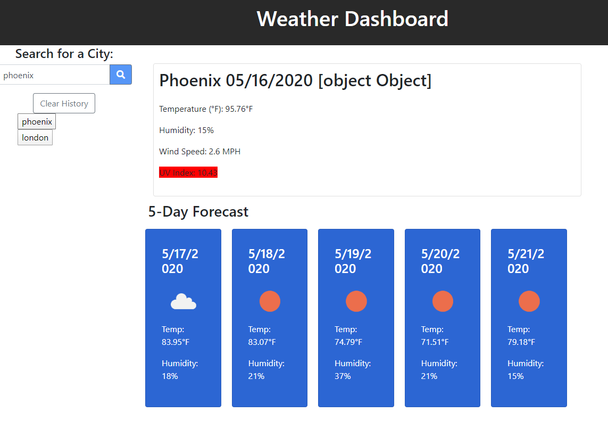

# WeatherDashboard

## User Story

```
AS A traveler
I WANT to see the weather outlook for multiple cities
SO THAT I can plan a trip accordingly
```


Example page when searching a city:


# Issues
- The weather icon on the daily weather continues to show up as an object, even though the icons show up on the forecast just fine. I tried to use JSON.stringify but no change. 
- Rendering the buttons was successful, but I wasn't able to make it display once the button is pressed. I don't believe I'm calling the functions correctly so that will need to be changed in the future.
- My local storage was also unseccessful in displaying when the page refreshes. It shows up in local storage, but does not display the buttons when refreshed so that's definitely something that needs to be worked on.

# Technology used
- jQuery
- [moment.js](https://momentjs.com/) - displays the date
- [fontawesome](https://fontawesome.com/) - for the search icon
- [Bootstrap](https://getbootstrap.com/) - CSS framework used
- [Weather API](https://openweathermap.org/)
