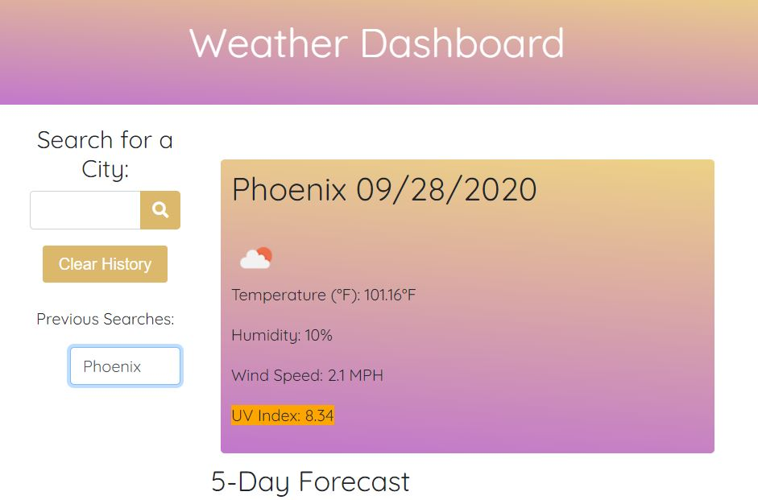

# Weather Dashboard

## User Story

```
AS A traveler
I WANT to see the weather outlook for multiple cities
SO THAT I can plan a trip accordingly
```

## Usage
This app allows a user to enter the city they would like to see the weather for, to then save to their last searched, and see the current forecast at any time.

Example page when searching a city:



## Technology used
- jQuery
- [moment.js](https://momentjs.com/) - displays the date
- [fontawesome](https://fontawesome.com/) - for the search icon
- [Bootstrap](https://getbootstrap.com/) - CSS framework used
- [Weather API](https://openweathermap.org/)

## Deployed link
https://linneagear.github.io/WeatherDashboard/